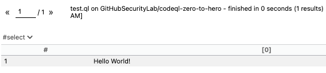

# Challenge 2 — Set up VS Code CodeQL starter workspace

In this challenge you will create a codespace — your own mini container in a virtual machine with everything you need to query a codebase using CodeQL: VS Code, CodeQL extension for VSCode, CodeQL command line tool preinstalled and a pre-existing CodeQL database. The workspace will enable you to run your own CodeQL queries in the later challenges.

You can choose between several options to do the exercises:
* Option A: (Recommended) GitHub Codespace (Using a Browser or VS Code - CodeQL is run remotely on a Linux based GitHub Codespace in the cloud)
* Option B: Local installation
* CodeQL in [neovim](https://github.com/pwntester/codeql.nvim)
* CodeQL in [emacs](https://github.com/anticomputer/emacs-codeql) 

## GitHub Codespace

Use a remote GitHub Codespace to work on the exercises.

### Prerequisites

* GitHub account ([sign up](https://github.com/) for free)
* Browser or [Visual Studio Code](https://code.visualstudio.com/download) (VS Code) with the [GitHub Codespaces](https://marketplace.visualstudio.com/items?itemName=GitHub.codespaces) extension installed on your local machine.

Note: The first 120h hours per core of Codespace usage are free per month, we use a codespace with 4 cores for this workshop since 4 cores is the current maximum for free accounts. (If you have a Pro account, we recommend switching to an 8-core machine.)

### Step-by-Step

1. Login to your [GitHub](https://github.com/login) account
2. Go to the repo https://github.com/github/codespaces-codeql
3. Click on Use this template -> Open in a codespace
4. Continue with the instructions in [#Running the code tour](https://github.com/github/codespaces-codeql#running-the-code-tour) section. Do the tutorial in the codespace.
5. Open the Command Palette with Cmd/Ctrl+Shift+P and type 'CodeQL: Create Query'. Choose the language that you'd like to analyze — for us it will be python. Type the name of a repository with that language, so that we can download the CodeQL database for it — for us it will be "GitHubSecurityLab/codeql-zero-to-hero".

=> This will generate a so called CodeQL pack, which contains configuration for running Python queries. At this point, you can write as many CodeQL for Python queries as you want inside the folder `codeql-custom-queries-python` that was generated. 

You can also download databases from GitHub by following the steps in the #sSelect CodeQL database section.

If you'd like to, you can choose another repository written in Python, but in that case the results after running the queries will be different. You can also choose another language and a repository in that language, but bear in mind that the queries for that language will be different than the ones in the blog post.

## Option B: Local installation

Use a local CodeQL installation to work on the exercises.

### Prerequisites

* Requires downloading up to 2 GB of data in total.
* [Visual Studio Code](https://code.visualstudio.com/download) (VS Code) and `git` installed on your local machine.

### Step-by-Step

1. Install [VS Code extension for CodeQL](https://marketplace.visualstudio.com/items?itemName=GitHub.vscode-codeql)
2. In the terminal, in a directory specified by you: `$ git clone https://github.com/github/vscode-codeql-starter.git`
3. `$ cd vscode-codeql-starter`
4. `$ git submodule init`
5. `$ git submodule update --recursive`
6. In VS Code: File -> **Open Workspace from File...** `vscode-codeql-starter.code-workspace`
7. Continue with [Selecting a CodeQL Database](#select-codeql-database)
8. Then [Test your installation](#test-your-installation)

### Troubleshooting the local installation

In case you see errors such as:
* `Failed to run query: Could not resolve library path for [..]`
* `Could not resolve module [..]` 
* `Could not resolve type [..]`

=> It is very likely that you missed cloning the git submodules (namely the ql repo). To fix this follow the [Step-by-Step](#step-by-step-1) instructions starting with step 3.

## Select CodeQL Database

1. Make sure you have the workspace `vscode-codeql-starter.code-workspace` open in VS Code.
2. Go To the CodeQL View
3. Click on choose the “Download database from GitHub” option, the one with the GitHub logo (Fun fact! Did you know that the character in the logo is called Monalisa? Now you know!). This option allows you to specify any public repo on GitHub to download as a CodeQL database - as long as it uses one of the supported languages by CodeQL. Write `sylwia-budzynska/codeql-zero-to-hero` and press Enter.

Now you can test your installation:

## Test your installation

### Prerequisites

Make sure that the previously chosen CodeQL database is selected in the CodeQL view. (Click on "Select" if it's not)

### Step-by-Step

1. In VS Code: go to the workspace folder: `codeql-custom-queries-python`
2. Create a new file `test.ql`
3. add the following content: `select "Hello World!"`
4. Save file and right click in file on "CodeQL: Run Query on Selected Database"

=>  The output should look like this:

Go to the [github/codespaces-codeql](https://github.com/github/codespaces-codeql) repository, press the “Use this template” button and choose “Open in a codescape”. Follow the instructions outlined in “Running the code tour” section. Download a CodeQL database according to the instructions below.

The rest of the challenges will assume that you have the VS Code with CodeQL extension and CodeQL starter workspace setup with a CodeQL database of your choice

Congrats on completing challenge 2! 🎉
