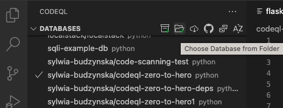

# Challenge 3 - Create CodeQL database using CodeQL CLI locally

The CodeQL command line tool allows you to create databases from locally-sourced code. In this challenge, you will create a database for the vulnerable code we used in earlier exercises. 

## Use the GitHub Codespace created in the previous challenge or install CodeQL CLI
The GitHub Codespace that you created in the previous challenge comes with CodeQL CLI preinstalled. If you did create the codespace, you can skip this section and go to [#create-a-codeql-database](#create-a-codeql-database).

If you did not create the codespace in the previous challenge, the easiest way to install the CodeQL CLI locally is as an extension to the `gh` CLI tool — GitHub's official CLI tool.
1. If you don't have `gh` installed, install it using the instructions [here](https://github.com/cli/cli#installation).
2. Install the CodeQL extension using:
```bash
gh extensions install github/gh-codeql
gh codeql install-stub
```
The second command will enable you to run the CLI tool just by typing `codeql` instead of `gh codeql`.
If you encounter any issues, check the [docs](https://github.com/github/gh-codeql#installation).

## Create a CodeQL database
For creating a CodeQL database, you can use the examples from this repository, or choose another open source repository. For creating CodeQL databases with languages other than Python, see docs.
1. Clone this repo to your local machine.
```bash
git clone https://github.com/sylwia-budzynska/codeql-zero-to-hero.git
```
2. Move to the cloned directory.
```bash
cd codeql-zero-to-hero
```
3. Create a CodeQL database
```bash
gh codeql database create example-codeql-db --language=python
```
4. Deactivate the virtual environment
```bash
deactivate
```
5. Go to the VS Code CodeQL extension, click on "Choose Database from folder" and select the "example-codeql-db" that you have created in step 5. 
If you haven't set up the premade codespace or installed VS Code with CodeQL extension, see the instructions in [challenge 2](https://github.com/sylwia-budzynska/codeql-zero-to-hero/blob/main/2/challenge-2/instructions.md).


And that's how you create and upload a CodeQL to continue with further analysis.
Congrats on completing challenge 3! 🎉
