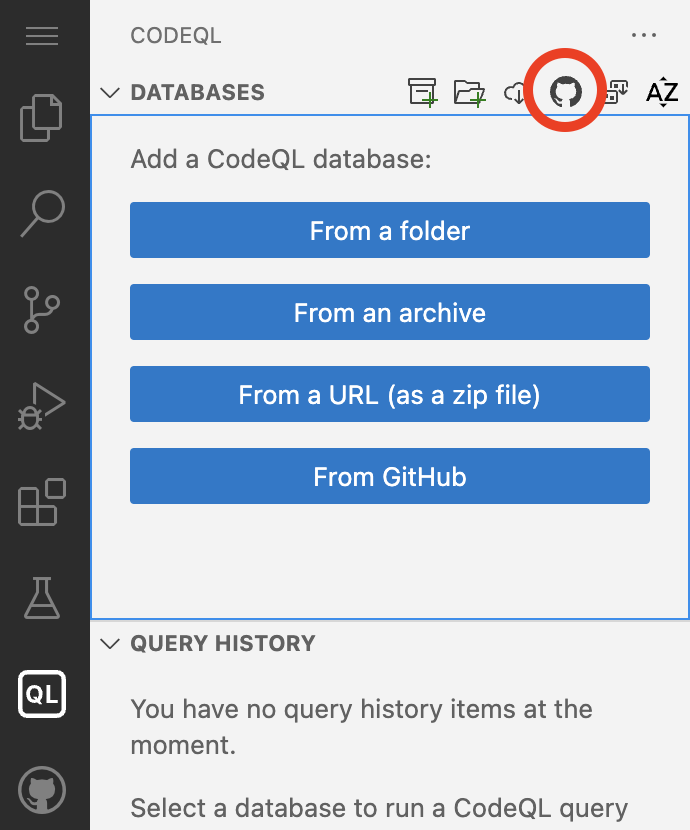
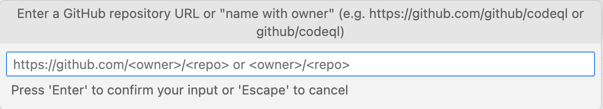
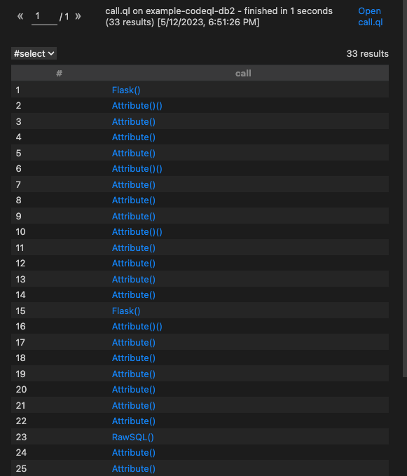

# Challenge 4 - Run a query to show all function calls

With the setup that you created in the earlier challenges, we will run the query to show all function calls. You can either use the codespace with VS Code, or use VS Code locally.

## Make sure you have the database selected
1. In the CodeQL tab, check that you have the `sylwia-budzynska/codeql-zero-to-hero` database downloaded and selected. There should be a checkmark next to the database name. If there isn't, hover over the database name until 'Select' button appears, then press that button.
2. If you haven't downloaded the database for this repository, go to the CodeQL tab and click on choose the “Download database from GitHub” option, the one with the GitHub logo. This option allows you to specify any public repo on GitHub to download as a CodeQL database - as long as it uses one of the supported languages by CodeQL. Write `sylwia-budzynska/codeql-zero-to-hero` and press Enter.




3. Check that the database is selcted, like in the step 1.

## Run the query
1. Got to the 'Explorer' tab and create a new file in the `codeql-custom-queries-python` folder. Call the file `call.ql` and copy the below query into the file.
```ql
import python

from Call call
where call.getLocation().getFile().getRelativePath().regexpMatch("2/challenge-1/.*")
select call
```
2. Hover over `Call` in the third line. This will show you the definition of the `Call` type. You can always hover over any part of the query to see if there is a definition for it.
3. Right click anywhere in the writing area of the query file and choose "CodeQL: Run Query on Selected Database"
4. After a few seconds you should see results, like so:


